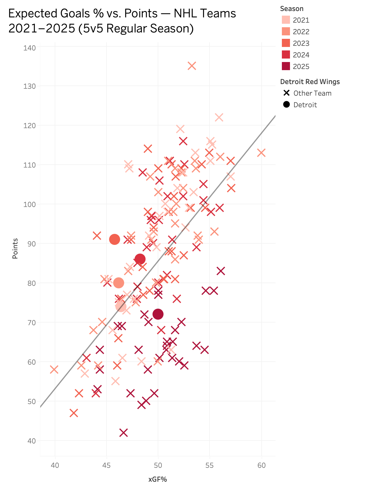
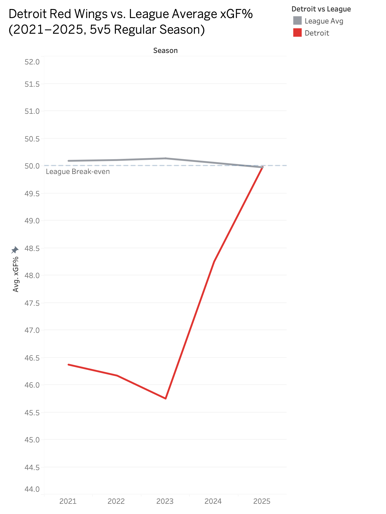
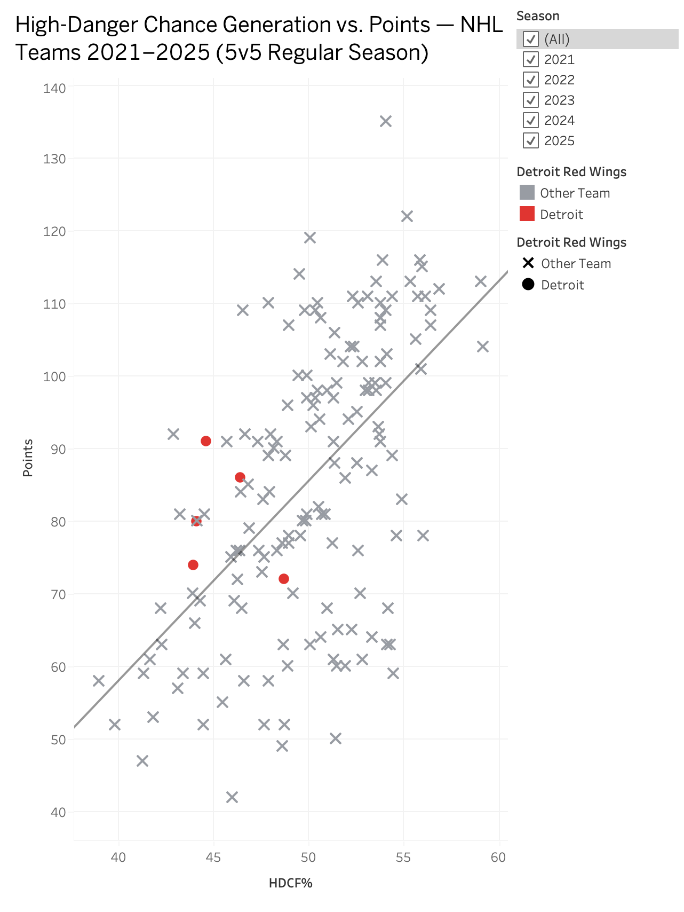
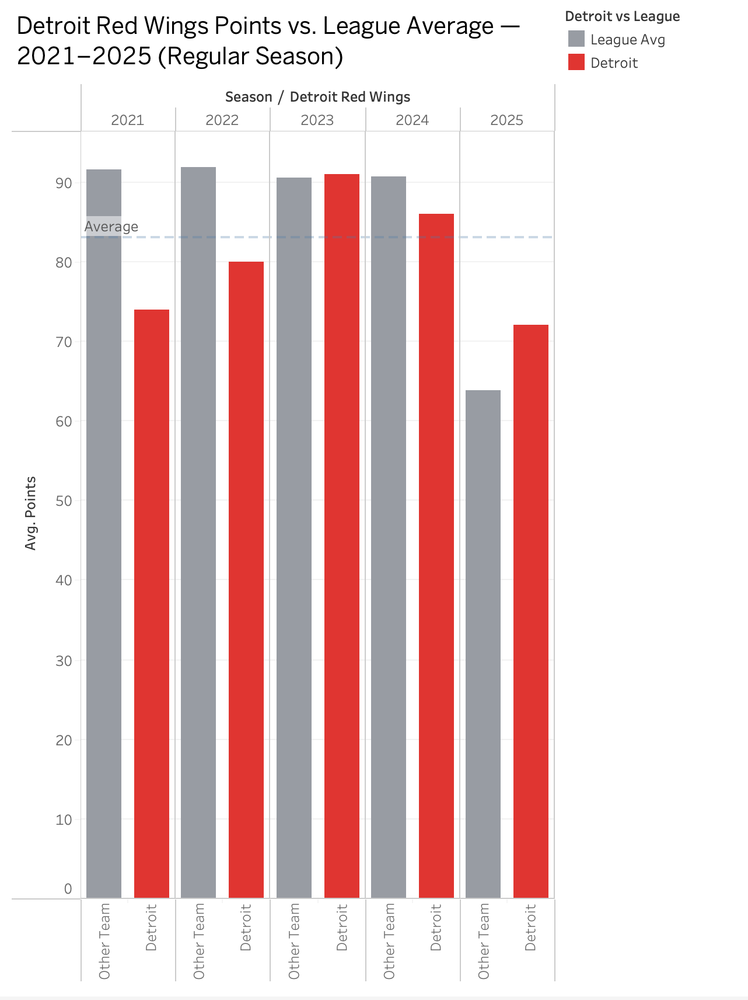
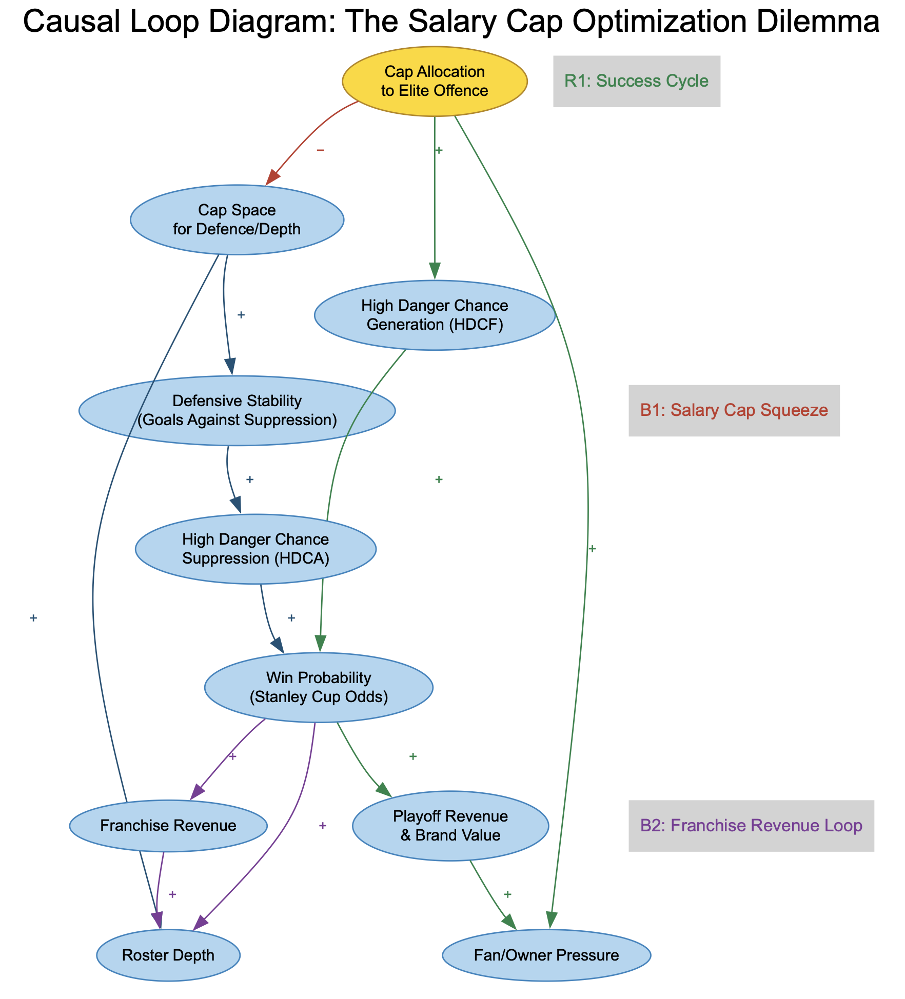

# Breaking the Bubble: Optimizing Salary Cap Allocation for Stanley Cup Contention
## BSAD 482 Term Project
**Term:** Winter 2026 | **Path:** Advanced | **Author:** Matteo Michelli

---

## Table of Contents
1. [Decision Framing](#decision-framing)
2. [Executive Summary](#executive-summary)
3. [Background](#background)
4. [Data Sources](#data-sources)
5. [Data Exploration](#data-exploration)
6. [System Dynamics](#system-dynamics)
7. [Interactive Dashboard](#interactive-dashboard)
8. [Recommendations](#recommendations)
9. [Limitations & Future Work](#limitations--future-work)
10. [References](#references)

---

## Decision Framing
> **The Decision:** Determining the optimal allocation of the team's projected $13M Salary Cap space for the 2026-2027 season: Should the team prioritize acquiring **High-Danger Chance Generation (Elite Offence)** or **High-Danger Chance Suppression (Elite Defence)** to maximize the statistical probability of a Stanley Cup victory? This analysis culminates in an interactive simulation dashboard that allows the decision-maker to model different cap allocation splits and observe their projected impact on win probability in real time.

---

## Executive Summary
In the modern NHL, the salary cap is the ultimate equalizer; championship teams are formed not by just acquiring skill, but by optimizing "wins per dollar" more effectively than their competition. The Detroit Red Wings are currently at a critical strategic turning point: following a seven-year rebuild, the franchise remains stuck in the statistical "bubble", too competitive to secure top lottery draft picks, but lacking the elite roster efficiency required to contend for the Stanley Cup. With the 2025-26 NHL salary cap set at $95.5 million and Detroit carrying a projected cap hit of $82.7 million, the franchise has approximately $12.8 million in projected cap space remaining (PuckPedia, 2026). General Manager Steve Yzerman faces a high-stakes resource allocation challenge that will determine the franchise's trajectory for the next decade.

This project addresses the core tension of roster construction: the trade-off between purchasing scarce, high-premium offensive production versus investing in cost-effective defensive suppression. While traditional hockey wisdom often favours defensive depth, modern analytics suggest that elite high-danger chance generation may offer a higher Return on Investment (ROI) in terms of pure win probability. However, due to the salary cap, investing heavily in one area mathematically necessitates weakness in the other.

Using a Decision Intelligence framework, this analysis utilizes historical team data and predictive modelling to assess the impact of these opposing strategies on playoff success. Demonstrating the feedback loops among roster investment, on-ice performance, and cap flexibility provides the General Manager with data-backed advice on how to utilize the team's remaining financial assets to maximize the likelihood of winning the Stanley Cup in 2027.

[Read more](Background.md)

---

## Background
Detroit has missed the playoffs for nine consecutive seasons (2016-2025). GM Steve Yzerman's "Yzerplan" focused on rebuilding through the draft, producing core players like Lucas Raymond, Moritz Seider, and Simon Edvinsson. The team now sits at an inflection point: internal growth alone is insufficient to cross the playoff threshold, and deliberate cap investment is required. See [Background.md](Background.md) for full context.

---

## Data Sources
Two sources cover all 32 NHL teams across five regular seasons (2020-21 through 2024-25) at 5-on-5 strength:

- **Natural Stat Trick** - Team-level stats including wins, points, xGF%, HDCF%, and Corsi. Combined into `data/games_2021-25.csv`.
- **MoneyPuck** - Team-level advanced metrics filtered to 5on5 situations only. Combined into `data/teams_2021-25.csv`.

All wrangling was performed in Tableau Prep. See [Wrangling.md](Wrangling.md) for full documentation and `data/README.md` for APA citations.

---

## Data Exploration

#### Viz 1: Expected Goals % vs. Points

This scatter plot shows the relationship between xGF% and regular season points for all 32 NHL teams across five seasons. The strong upward trend line confirms that expected goals percentage is a reliable predictor of standings success. Detroit's data points (red circles) consistently appear in the bottom-left cluster, below 50% xGF and below league average in points, visually confirming the gap Yzerman must close.

---

#### Viz 2: Detroit vs. League Average xGF%

This line chart tracks Detroit's average xGF% at 5v5 against the league average from 2021 to 2025. The league average holds steady near 50% while Detroit bottomed out at 45.75% in 2023 before climbing sharply to 49.98% in 2025, nearly reaching the break-even line. This trend validates the Yzerplan's trajectory but highlights the urgency: Detroit has not yet crossed the 50% threshold that separates contenders from bubble teams.

---

#### Viz 3: High-Danger Chance Generation vs. Points

This scatter plot examines the relationship between HDCF% and regular season points. The positive trend confirms that teams generating more high-danger chances tend to accumulate more points. Detroit's data points cluster in the lower-left, indicating below-average offensive high-danger generation across all five seasons.

---

#### Viz 4: Detroit Points vs. League Average

This bar chart compares Detroit's regular season points to the league average each season from 2021 to 2025. Detroit fell below the league average every season except 2023, where it nearly matched it with 91 points before regressing to 86 in 2024 and 72 in 2025 (partial season). This reinforces the "bubble team" framing - consistently close, never through.

---

## System Dynamics

### Causal Loop Diagram

### CLD Explanation

The Causal Loop Diagram above maps the systemic forces that govern Detroit's cap allocation decision. The system is driven by three interlocking feedback loops, each of which constrains or amplifies the others.

**R1: The Success Cycle (Reinforcing Loop)** captures the self-reinforcing dynamic of winning. As Win Probability increases, Playoff Revenue and Fan/Owner Pressure both rise. This pressure compels management to increase Allocation to Elite Offence to sustain momentum, which in turn drives further offensive output and win probability. Left unchecked, this loop creates a snowball effect of rising expectations and spending. For Detroit, this loop has not yet been activated because the team has not reached the playoff threshold that triggers it.

**B1: The Salary Cap Squeeze (Balancing Loop)** acts as the system's hard structural constraint. Every dollar allocated to Elite Offence directly reduces Cap Space for Defence and Depth. As defensive investment falls, Defensive Stability erodes, High-Danger Chance Suppression (HDCA) worsens, and Win Probability is pulled back down. This loop explains why purely offensive spending strategies have a ceiling: at some point, the defensive vulnerabilities created by the cap trade-off undermine the offensive gains.

**B2: The Franchise Revenue Loop (Balancing Loop)** connects on-ice success to broader financial flexibility. Improved Win Probability drives Franchise Revenue through ticket sales, merchandise, and broadcast value. This revenue supports Roster Depth investment, which supports Win Probability - but always subject to the NHL's hard salary cap ceiling, which prevents revenue from translating directly into unlimited spending.

The most promising **leverage point** in this system is Cap Allocation to Elite Offence. The data shows that xGF% - the primary downstream outcome of offensive investment - has a 2.83-point-per-percentage-point impact on standings, six times greater than the impact of defensive investment alone. Intervening at this node, by committing the majority of the $12.8M to a high-impact offensive player, would activate R1, suppress B1's drag, and provide the largest probability of crossing the 50% xGF% break-even threshold into playoff contention.

### CLD Evidence Links

**Link 1: HDCF → Win Probability**
Supported by Viz 3, which shows a strong positive relationship between HDCF% and regular season points across 160 team-seasons (2021-2025).

**Link 2: Cap Allocation to Elite Offence → HDCF**
Macdonald (2012) demonstrated that shot-based metrics, particularly high-danger chances, are stronger predictors of future goals than raw totals (r = 0.67-0.69). Skilled forwards are the primary drivers of slot-area shot attempts.

**Link 3: xGF% → Win Probability**
Supported by Viz 1, which shows a strong upward league-wide trend between xGF% and points across all 160 team-seasons.

---

## Interactive Dashboard

### Live Dashboard
[Breaking the Bubble - Cap Allocation Simulator](https://matteomichelli.shinyapps.io/breaking-the-bubble/)

### User Guide
- **Decision Context** - Overview of the decision, key metrics, and the core tension between offensive and defensive investment
- **League Explorer** - Interactive scatter plot comparing all 32 NHL teams. Filter by season and switch between xGF%, HDCF%, and CF%
- **Detroit Trends** - Line chart tracking Detroit vs the league average 2021-2025. Toggle between xGF%, HDCF%, and Points
- **Cap Simulator** - Use sliders to allocate Detroit's $12.8M between Elite Offence and Defence and see the projected impact on xGF%, HDCF%, standings points, league rank, and playoff probability

### Implications for the Decision
The regression model trained on 160 team-seasons shows each 1% xGF% improvement is worth approximately 2.83 standings points, roughly 6x the impact of a 1% HDCF% improvement. The simulator consistently shows that allocating the majority of the $12.8M toward elite offensive talent produces the largest projected point gain and highest playoff probability. A purely defensive allocation improves suppression metrics but falls short of the points needed to qualify.

---

## Recommendations

**To:** Steve Yzerman, General Manager, Detroit Red Wings
**Re:** 2026-27 Cap Allocation Strategy
**From:** Decision Intelligence Analysis, BSAD 482

**Recommendation: Allocate the majority of Detroit's available cap space to Elite Offence.**

The data across five NHL seasons (2021-2025) makes a clear case. Expected goals percentage - the metric most directly improved by elite offensive players - is the strongest statistical predictor of standings success in this dataset, contributing approximately 2.83 points per percentage point gain. Detroit's current xGF% of 49.98% sits just below the 50% break-even threshold that every consistent playoff team exceeds. A single high-impact offensive acquisition capable of moving that number by 1.5-2 percentage points would project Detroit into the 95-100 point range, well within wild card contention.

The evidence also challenges the case for a purely defensive strategy. While High-Danger Chance Suppression (HDCA) does correlate with wins, its per-dollar impact on standings is approximately six times weaker than offensive generation. Spending $12.8M on two defensive defencemen would improve Detroit's HDCA but would be unlikely to close the offensive gap that is the primary driver of their bubble status. The team's 2024 season - where a defensive collapse (188 HDCA, up from 151 the prior year) contributed to a regression from 91 to 86 points - does illustrate real defensive risk. This suggests a split of roughly 65-70% toward offence and 30-35% toward defensive depth is optimal, rather than an all-in offensive approach.

Specifically, the next steps Yzerman should consider are targeting a proven top-six forward with a demonstrated history of driving xGF% above 52% at 5v5, while using the remaining cap space on a reliable third-pairing defenceman to address the HDCA vulnerability. Free agent and trade targets should be evaluated using Natural Stat Trick and MoneyPuck 5v5 data, not raw goals or points, to avoid overpaying for players whose production is driven by power play time or unsustainably high shooting percentages.

This recommendation would change if Detroit's young core - particularly Marco Kasper and Simon Edvinsson - underperforms their contracts in 2025-26, in which case internal growth may not support the offensive floor assumed here. Additional player-level xGF% and HDCF data by individual would significantly strengthen this analysis and is the recommended next step for Milestone progression.

---

## Limitations & Future Work

This analysis operates at the **team level**, which limits precision. Team-level xGF% reflects the aggregate of all players on the roster, making it difficult to isolate the exact contribution a single free agent acquisition would make. Player-level data from Natural Stat Trick and MoneyPuck would allow a more targeted simulation of specific roster moves, which is the natural extension of this work for a Milestone 4 decision support tool.

The **regression model** used in the simulator has an R² of 0.49, meaning approximately half of the variance in standings points is explained by xGF% and HDCF% alone. Other factors - goaltending performance, special teams, schedule strength, and injury luck - account for the remainder and are not modelled here.

The **2025 season data is partial** (58 games per team at time of download), which means it is extrapolated to 82 games. This introduces uncertainty into Detroit's baseline figures. The 2025 data is treated with appropriate caution throughout.

Future work should incorporate **player-level cap efficiency data** to simulate specific free agent signings, integrate **goaltending metrics** as a third regression variable, and extend the model to include **playoff win probability** rather than just regular season points as the outcome variable.

---

## References

Macdonald, B. (2012). *An expected goals model for evaluating NHL teams and players*. Proceedings of the MIT Sloan Sports Analytics Conference, March 2-3, 2012, Boston, MA, USA. https://www.hockeyanalytics.com/Research_files/NHL-Expected-Goals-Brian-Macdonald.pdf

MoneyPuck. (2026). *NHL team statistics 2021-2025* [Data set]. https://moneypuck.com/data.htm

Natural Stat Trick. (2026). *NHL team statistics 2021-2025, 5v5 regular season* [Data set]. https://www.naturalstattrick.com/

Octopus Thrower. (2025, June 16). *How the looming salary cap boost can reshape the Red Wings plans*. https://octopusthrower.com/how-the-looming-salary-cap-boost-can-reshape-the-red-wings-plans

Pro Hockey Rumors. (2025, October 22). *Salary cap deep dive: Detroit Red Wings*. https://www.prohockeyrumors.com/2025/10/salary-cap-deep-dive-detroit-red-wings-9.html

PuckPedia. (2026, March 2). *Detroit Red Wings salary cap and contracts*. https://puckpedia.com/team/detroit-red-wings
